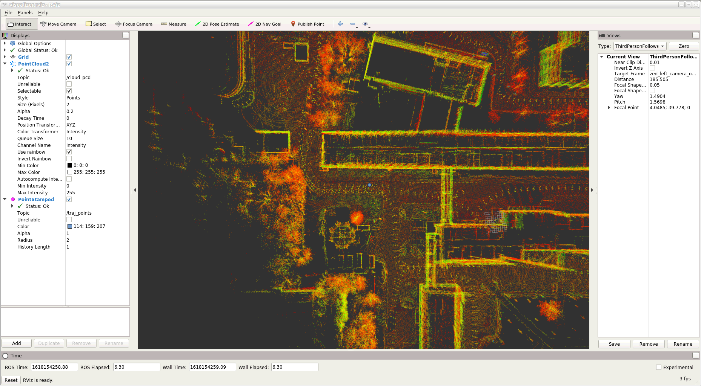

# Локализуй робота на Физтехе

## Описание данных

Структура директорий:
```
intrinsics.yaml
map.pcd
train/
├───2021-03-27-10-32-53/
│   ├───depth.txt
│   ├───depth/
│   │   ├───2021-03-27-10-32-53_depth_000000.exr
│   │   ├───2021-03-27-10-32-53_depth_000001.exr
│   │       ...
│   ├───rgb_left.txt
│   ├───rgb_left/
│   │   ├───2021-03-27-10-32-53_rgb_left_000000.png
│   │   ├───2021-03-27-10-32-53_rgb_left_000001.png
│   │       ...
│   ├───rgb_right.txt
│   ├───rgb_right/
│   │   ├───2021-03-27-10-32-53_rgb_right_000000.png
│   │   ├───2021-03-27-10-32-53_rgb_right_000001.png
│   │       ...
│   ├───gt_kitti.txt
│   └───gt_tum.txt
├───2021-03-27-10-17-01/
│       ...
└───2021-03-27-09-08-15/
        ...
test/
├───2021-03-27-03-30-47/
│       ...
└───2021-03-31-12-33-50/
        ...
```

Датасет состоит из трех обучающих последовательностей (2021-03-27-10-32-53, 2021-03-27-10-17-01, 2021-03-27-09-08-15) и двух тестовых (2021-03-27-03-30-47, 2021-03-31-12-33-50). Каждая последовательность представлена набором изображений с левой (rgb_left) и правой (rgb_right) камер (сохраненных в формате PNG), а также картами глубины (depth) (в формате EXR). Изображения и карты глубин синхронизованы по времени (т.е. 2021-03-27-10-32-53_rgb_left_000000.png, 2021-03-27-10-32-53_rgb_right_000000.png, 2021-03-27-10-32-53_depth_000000.exr сняты в один и тот же момент времени). В файлах depth.txt, rgb_left.txt, rgb_right.txt содержатся соответсвия между временем фиксации и путем к файлу относительно корня директории последовательности, напр:

        1616850495.821276172 depth/2021-03-27-09-08-15_depth_000000.exr

Первые три строки файлов закомментированы для совместимости с форматом TUM, на котором основан формат данных хакатона.

Для каждой обучающей последовательности, для каждого кадра, задано положение робота на карте в файлах gt_kitti.txt и gt_tum.txt. Оба файла содержат одни и те же данные, но в разных форматах. Количество строк в файлах равно количеству кадров и соответствие между номером кадра и строкой в этих файлах однозначное. 

gt_kitti.txt содержит данные в формате KITTI. В каждой строке записано 12 чисел, разделенных пробелом. Эти числа - построчная запись матрицы 3x4, задающей положение робота на карте.

gt_tum.txt содержит данные в формате TUM. В каждой строке записано 9 чисел. Первое число - время, следующие три задают положение робота на карте - координаты X, Y, Z, следующие 4 задают ориентацию робота - компоненты x, y, z, w единичного кватерниона. Т.е. формат строки следующий:

        <время> <X> <Y> <Z> <qx> <qy> <qz> <qw>

В тестовых последовательностей также присутствуют файлы gt_kitti.txt и gt_tum.txt. Однако они содержат только первую строку, то есть положение и ориентацию робота в начале движения.

Обратите внимание, что времена, записанные в файлы gt_kitti.txt, gt_tum.txt и в файлы depth.txt, rgb_left.txt, rgb_right.txt для соответствующих строк отличаются. Гарантируется, что это различие не превышает 50 мс.

Файл intrinsics.yaml содержит внутренние параметры калибровки стереокамеры ZED:
```yaml
width: 1280  # ширина изображения, пиксели
height: 720  # высота изображения, пиксели
fx: 683.7561645507812  # фокусное расстойние по оси X, пиксели
fy: 683.7561645507812  # фокусное расстойние по оси Y, пиксели
cx: 615.1193237304688  # оптический центр по оси X, пиксели
cy: 345.3215637207031  # оптический центр по оси Y, пиксели
baseline: 0.11976403418795  # расстояние между оптическими осями левой и правой камер, метры
fx_baseline: 81.88939666748047  # fx * baseline
```

Файл map.pcd содержит карту кампуса в виде набора точек. Пример кода для чтения карты - scripts/read_pcd.py. Для его запуска потребуется библиотека pypcd (`python -m pip install pypcd`)

## Базовые решения
В директории baselines можно найти базовые решения предложенной задачи.

## Визуализация карты кампуса и траекторий

```bash
# переходим в директорию со скриптами для работы с docker
cd docker

# собираем образ
bash build.sh

# запускаем контейнер
bash start.sh

# входим в контейнер
bash into.sh

# переходим в рабочее пространство
cd catkin_ws/

# запускаем сборку
catkin_make

# активируем окружение
source devel/setup.bash

# запускаем визуализацию GT траектории (также можно визуализировать submission)
roslaunch yaprofi_hack visualize.launch \
        traj:=/data_fast/IPROFI/train/2021-03-27-10-32-53/gt_tum.txt \
        rate:=100
```
В результате успешного запуска откроется rviz, в котором будет двигаться точка:

Используя панели слева и справа можно настроить визуализацию. С помощью мыши можно управлять полем зрения.

## Метрика качества

Реализация вычисления метрики качества - scripts/evaluate.py