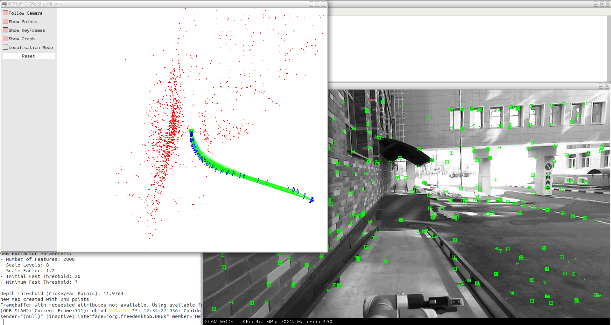

# ORB-SLAM2

Статья: https://arxiv.org/abs/1610.06475

Реализация метода на C++: https://github.com/raulmur/ORB_SLAM2

Python обертка над ORB_SLAM2: https://github.com/jskinn/ORB_SLAM2-PythonBindings

Метод позволяет построить траекторию робота без привязки к заранее построенной карте местности. При этом внутри он строит свою карту, начало которой совпадает с началом движения робота.

## Запуск

```bash
# переходим в корень папки базового решения
cd baselines/orbslam2
# переходим в директорию со скриптами для работы с docker
cd docker

# собираем образ
bash build.sh

# запускаем контейнер
# внутри будут доступны следующие директории:
# - /home/${USER} (read/write)
# - /data/${USER} (read/write)
# - /data_fast/${USER} (read/write)
# - /data_fast/IPROFI (read only)
bash start.sh

# входим в контейнер
bash into.sh

# переходим в директорию с решением
cd orbslam2

# можно посмотреть параметры скрипта
python3 scripts/run_orbslam2_rgbd.py -h

# запускаем на тестовой последовательности
# в результате в корневой папке orbslam2 будет сгенерирован файл trajectory.txt с траекторией робота
python3 scripts/run_orbslam2_rgbd.py --vocab ORBvoc.txt --config MIPT_Husky.yaml --seq /data_fast/IPROFI/test/2021-03-27-03-30-47/
```

В результате успешного запуска откроется визуализатор PangolinViewer. В нем будет отображаться текущий кадр с нанесенными ключевыми точками, а также трехмерная карта ключевых точек.


Обратите внимание, ранее был запущен SLAM в режиме RGB-D, также есть режимы STEREO и MONO.

После завершения работы файл trajectory.txt будет содержать траекторию движения. В каждой строке будет 13 чисел: первое - время, остальные 12 - построчная запись матрицы 3x4, задающей положение робота на карте, как в KITTI. При этом начало движения будет задано единичной матрицей.

Далее необходимо преобразовать траекторию к правильной начальной точке на карте и сохранить только координаты X, Y, Z. Сделать это можно с помощью скрипта:

```bash
python3 scripts/trajectory_to_submission.py --traj trajectory.txt --seq /data_fast/IPROFI/test/2021-03-27-03-30-47/
```
